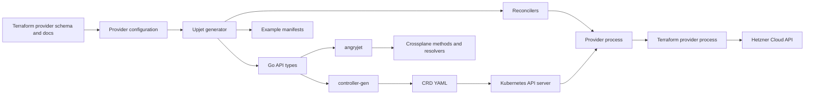

# How DNS zone management was added

This provider is generated, not handwritten. The small maintained input is translated by Upjet into Kubernetes APIs, controllers, CRDs, and examples. DNS support adds two Terraform resources:

- `hcloud_zone` becomes `Zone`.
- `hcloud_zone_rrset` becomes `ZoneRRSet`.

The implementation uses the authoritative DNS resources in the Hetzner Cloud Terraform provider. `hcloud_rdns`, from the separately linked OpenTofu page, manages reverse DNS (PTR names attached to servers, primary IPs, floating IPs, or load balancers); it does not create authoritative zones or their record sets.

Source material:

- [Hetzner Cloud Terraform provider](https://github.com/hetznercloud/terraform-provider-hcloud)
- [Hetzner Cloud API: Zones and Zone RRSets](https://docs.hetzner.cloud/reference/cloud#zones)
- [Upjet: adding a new resource](https://github.com/crossplane/upjet/blob/main/docs/adding-new-resource.md)
- [Crossplane managed resources](https://docs.crossplane.io/latest/managed-resources/managed-resources/)

## Generated-provider architecture



At runtime, Kubernetes stores the desired `Zone` or `ZoneRRSet`. A generated controller watches it. Upjet converts `spec.forProvider` into Terraform configuration, runs the pinned `hcloud` provider, and writes observed Terraform state into `status.atProvider`. Crossplane conditions report reconciliation state. A finalizer keeps the Kubernetes object until external deletion finishes.

This design reuses the Terraform provider's API client, validation, CRUD logic, state upgrades, and import behavior. No second Hetzner client or handwritten CRUD controller is needed.

## 1. Confirm resources exist in the Terraform schema

`Makefile` pins `hetznercloud/hcloud` version `1.59.0`. `config/schema.json` already contains resource schemas for both `hcloud_zone` and `hcloud_zone_rrset`, including required, optional, computed, and sensitive flags.

Upjet reads those flags to split generated fields:

- `spec.forProvider` holds desired Terraform arguments.
- `spec.initProvider` holds create-only values ignored after creation when management policies enable that behavior.
- `status.atProvider` holds observed Terraform state.

The Terraform docs scraped into `config/provider-metadata.yaml` supply descriptions, examples, references, and import statements.

## 2. Define external identities

`config/external_name.go` maps every included Terraform resource to its external identity.

```go
"hcloud_zone": config.IdentifierFromProvider,
"hcloud_zone_rrset": config.TemplatedStringAsIdentifier(
    "",
    "{{ .parameters.zone }}/{{ .parameters.name }}/{{ .parameters.type }}",
),
```

Crossplane stores external identity in the `crossplane.io/external-name` annotation.

Zones receive their numeric ID from Hetzner after creation. RRSets have a compound import identity: zone ID or name, RRSet name, and RRSet type. For example, `example.com/www/A`. Encoding that rule is essential: Observe, import, update, and delete must all address the same remote object.

Adding entries here also includes these resources in generation because `GetProvider` passes `ExternalNameConfigured()` to Upjet's include list.

## 3. Configure groups, kinds, and references

Four small configuration packages cover both Crossplane scopes:

- `config/cluster/zone`
- `config/cluster/zonerrset`
- `config/namespaced/zone`
- `config/namespaced/zonerrset`

Both resources use short group `dns`, producing these API groups:

- Cluster scoped: `dns.hetzner.crossplane.io`
- Namespaced: `dns.hetzner.m.crossplane.io`

`ZoneRRSet` is explicitly named to preserve the standard acronym. Its `zone` field references `hcloud_zone`:

```go
r.References["zone"] = config.Reference{TerraformName: "hcloud_zone"}
```

Upjet turns this into three mutually exclusive ways to supply the parent:

- `zone`: raw Hetzner zone ID or name.
- `zoneRef.name`: direct Kubernetes object reference.
- `zoneSelector.matchLabels`: label selector.

Resolver code fetches the referenced `Zone` and inserts its external name into Terraform input. This lets Kubernetes dependency resolution replace hard-coded remote IDs.

## 4. Register configuration

`config/provider.go` imports and calls both resource configurators for cluster and namespaced providers. `pc.ConfigureResources()` applies defaults, external-name rules, references, naming, and schema metadata.

`config/provider_test.go` provides the smallest useful maintained-code check. It verifies:

- both resources are included;
- both use the `dns` group;
- RRSet kind is `ZoneRRSet`;
- `ZoneRRSet.zone` targets `hcloud_zone`.

## 5. Generate code

Run from repository root:

```bash
make submodules
make generate
```

`apis/generate.go` documents the exact pipeline:

1. Remove old generated CRDs and generated Go files.
2. Scrape Terraform resource docs into provider metadata.
3. Run `cmd/generator`, which invokes Upjet for cluster and namespaced scopes.
4. Run `controller-gen` for deepcopy methods and CRD YAML.
5. Run `angryjet` for Crossplane managed-resource methods and reference resolvers.

Important generated outputs are:

| Output | Purpose |
| --- | --- |
| `apis/{cluster,namespaced}/dns/v1alpha1/zz_*_types.go` | Kubernetes spec, status, validation markers, and GVKs |
| `apis/{cluster,namespaced}/dns/v1alpha1/zz_*_terraformed.go` | Terraform parameter/state conversion |
| `apis/{cluster,namespaced}/dns/v1alpha1/zz_generated.resolvers.go` | `zoneRef` and `zoneSelector` resolution |
| `internal/controller/{cluster,namespaced}/dns/*/zz_controller.go` | Managed reconciler registration |
| `package/crds/dns.*_zones.yaml` | Installable Zone CRDs |
| `package/crds/dns.*_zonerrsets.yaml` | Installable ZoneRRSet CRDs |
| `examples-generated/{cluster,namespaced}/dns/` | Examples translated from Terraform docs |

Never hand-edit `zz_` files. Change schema inputs or `config/`, regenerate, and review generated changes.

## 6. What the generated reconciler does

Each controller registers a standard Crossplane managed reconciler. Reconciliation is level-based and idempotent:

1. Watch a managed resource and resolve references.
2. Load credentials through its `ProviderConfig`.
3. Build a Terraform workspace for the resource.
4. Refresh state to observe the Hetzner object.
5. Create it when absent, update it when desired and observed fields differ, or leave it unchanged.
6. Copy observed fields to `status.atProvider` and update `Synced` and `Ready` conditions.
7. On Kubernetes deletion, call Terraform delete before removing the finalizer.

The generated controller supplies orchestration. Terraform resource code supplies Hetzner-specific CRUD behavior. Upjet's connector is the adapter between them.

## 7. Use it

Create provider credentials as described in the root README, then apply the namespaced example:

```bash
kubectl apply -f examples/namespaced/dns/zone-and-records.yaml
kubectl get zones,zonerrsets -n crossplane-system
kubectl describe zone example-com -n crossplane-system
```

The same API is available cluster-wide by removing `namespace` and using API group `dns.hetzner.crossplane.io`.

Primary zones accept records managed by `ZoneRRSet`. Secondary zones instead require `primaryNameservers`; their data arrives through AXFR. Hetzner does not allow changing zone mode in place, so changing `mode` requires replacement.

For TXT records, each value must contain one or more quoted chunks no longer than 255 characters. Crossplane YAML must therefore preserve those inner quotes, as the example does.

## 8. Validate before release

```bash
go test ./config/... ./apis/... ./internal/controller/...
go vet ./config/... ./apis/... ./internal/controller/...
make reviewable
```

For a real integration test, build and install the local package in a disposable cluster, apply `examples/namespaced/dns/zone-and-records.yaml`, verify records through Hetzner or `dig`, modify a value, then delete all RRSets before deleting the zone. Use a test domain and token; these operations affect public DNS.

## 9. Import existing DNS objects

Set the external-name annotation and use Observe-only management first:

```yaml
metadata:
  annotations:
    crossplane.io/external-name: example.com/www/A
spec:
  managementPolicies: [Observe]
```

For a zone, external name may be its Hetzner ID. For an RRSet, use `ZONE_ID_OR_NAME/RRSET_NAME/RRSET_TYPE`. After observed state matches the manifest, expand management policies deliberately. Importing first in Observe-only mode avoids accidental mutation of live DNS.
